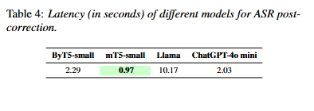

# Fine-Tuning and Inference with ByT5
This repository demonstrates the fine-tuning and evaluation of ByT5, a tokenizer-free extension of the [mT5 model](https://arxiv.org/abs/2010.11934) . ByT5 operates directly on UTF-8 bytes, eliminating the need for subword tokenization and making it particularly suitable for tasks involving noisy text or language-sensitive applications.

This project fine-tunes ByT5 on a custom dataset for text correction and evaluates its performance on unseen test data.
-----------------------------------------------------------------------------------------------------------
## Features
-----------------------------------------------------------------------------------------------------------
Fine-Tuning: Train the ByT5 model on a custom dataset with paired input-output sequences.
Inference: Generate predictions using the fine-tuned model.
Evaluation: Assess model performance on a test set and save results for analysis.

-----------------------------------------------------------------------------------------------------------
## Usage
-----------------------------------------------------------------------------------------------------------
Training and Fine-Tuning
To fine-tune the ByT5 model on a custom dataset:

1. Prepare a training dataset (inputdataset24.csv) with two columns:
    Hypothesis: Input text (e.g., incorrect text).
    Corrected Hypothesis: Target text (e.g., corrected text).
   Run the fine-tuning script:
```bash
python inference.py
```


### Inference
To run inference using the fine-tuned model:

1. Prepare a test dataset (testIC.csv) with a single column (Hypothesis) containing input text.

2. Run the inference script:
```bash
python inference.py
```

The script: Loads the fine-tuned model and tokenizer. Processes the test dataset. Generates predictions and saves them in output/predINDIC.csv.

### Evaluation
To evaluate the model's performance on a test set

1. Ensure the test dataset has the columns:

Ground Truth: Reference text. Hypothesis: Model input text.

2. The evaluation results, including predictions, are saved in output/predw2v.csv

## Evaluated on different finetuned models
See some latency results , result of the result include in paper (coming soon). 



### Model Checkpoints
The fine-tuned model and tokenizer are saved at:
```bash
Model/llmfine/
Model/llmtoken/
```
(Model checkpoints will only be released after final paper acceptance at EMNLP)

### Requirements
Python 3.8+ Libraries: Hugging Face Transformers PyTorch Datasets JiWER WandB Accelerate scikit-learn pandas


```bash
pip install transformers datasets torch wandb accelerate jiwer scikit-learn pandas
```
